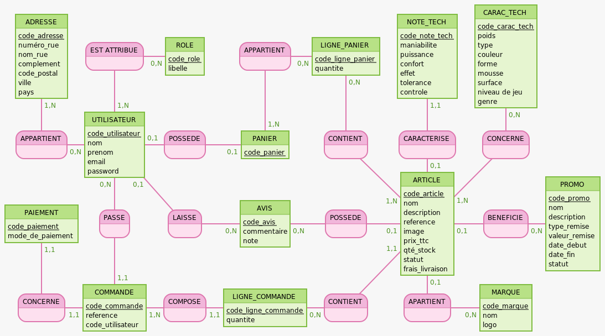

# Modèle Conceptuel de Données (MCD)




```bash
NOTE_TECH : code_note_tech, maniabilite, puissance, confort, effet, tolerance, controle
CONTIENT, 11 ARTICLE, 0N LIGNE_COMMANDE
LIGNE_COMMANDE: code_ligne_commande, quantite
COMPOSE, 1N COMMANDE, 11 LIGNE_COMMANDE
COMMANDE: code_commande, reference, code_utilisateur
CONCERNE2, 11 PAIEMENT, 11 COMMANDE

CARACTERISE, 01 ARTICLE, 11 NOTE_TECH
ARTICLE: code_article, nom, description, reference, marque, image, prix_ttc, qté_stock, statut, frais_livraison
POSSEDE2, 01 ARTICLE, 0N AVIS
AVIS: code_avis, commentaire, note
PASSE, 11 COMMANDE, 0N UTILISATEUR
PAIEMENT: code_paiement, mode_de_paiement

CONCERNE, 1N ARTICLE, 0N CARAC_TECH
BENEFICIE, 0N PROMO, 01 ARTICLE
CONTIENT2, 1N ARTICLE, 0N LIGNE_PANIER
LAISSE, 0N AVIS, 01 UTILISATEUR
UTILISATEUR: code_utilisateur, nom, prenom, email, password,
EST ATTRIBUE, 0N ROLE, 1N UTILISATEUR

CARAC_TECH : code_carac_tech, poids, type, couleur, forme, mousse, surface, niveau de jeu, genre
PROMO: code_promo, nom, description, type_remise, valeur_remise, date_debut, date_fin, statut
LIGNE_PANIER: code_ligne_panier, quantite
POSSEDE, 01 PANIER, 01 UTILISATEUR
APPARTIENT, 0N UTILISATEUR, 1N ADRESSE
ROLE: code_role, libelle

:
:
APPARTIENT2, 1N PANIER, 0N LIGNE_PANIER
PANIER: code_panier
ADRESSE: code_adresse, numéro_rue, nom_rue, complement, code_postal, ville, pays
:

```